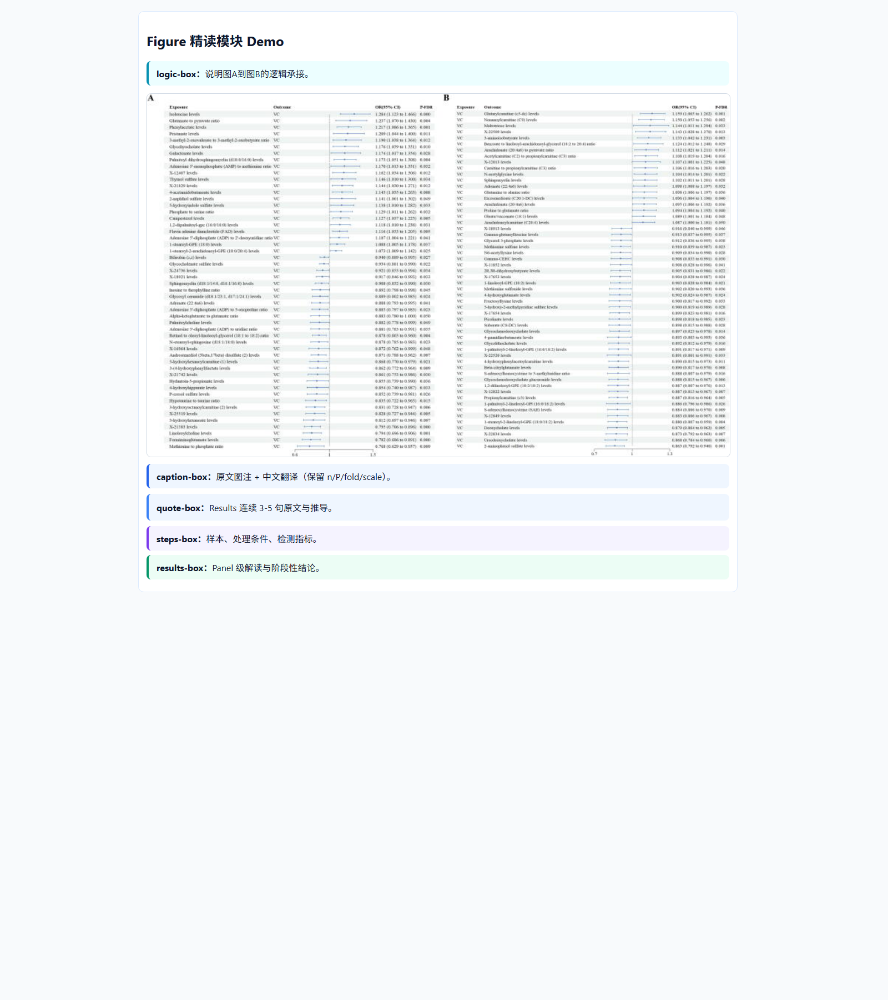

# paper-fastread

把单篇科研论文快速重构为**9章节中文讲义 HTML**（可投屏），重点强化：

- Figure 逐图逻辑链条（承上启下）
- Results 原文 3-5 句连续提取
- 图注中文翻译参数完整性（`n=`, `P<`, `fold change`, `scale bar`）
- 核心方法学深挖与课堂讨论题

> 该仓库既是技能源码（`SKILL.md` + `references/` + `templates/`），也用于 GitHub 展示与协作。

## 功能亮点

- 固定输出 9 章节，结构统一、可复用
- Figure 模块强制结构：`logic-box → caption-box → quote-box → steps-box → results-box`
- 默认文献源策略：**OpenAlex 优先**，医学论文可追加 PubMed 交叉验证
- 已集成 `paper-distill-mcp` 工作流（检索文献、抓取主图链接）

## 快速开始

### 1) 安装并连接 paper-distill-mcp（OpenCode）

```bash
uv tool install paper-distill-mcp
opencode mcp list
```

确保输出里有：`paper-distill connected`。

### 2) 文献源配置（建议）

```bash
OPENALEX_EMAIL=your-email@example.com
NCBI_EMAIL=your-email@example.com
NCBI_API_KEY=your-ncbi-api-key
```

> 详细说明见 `references/literature-source-setup.md`。

### 3) 生成讲义

按 `SKILL.md` 的 Session start 提示先做来源检查，再进入讲义生成。

## 仓库结构

```text
paper-fastread/
├── SKILL.md
├── references/
├── templates/
├── tools/
├── examples/
└── assets/screenshots/
```

## 展示截图

以下截图来自示例 HTML（`examples/Blood_metabolites_VC_PMID40139524_lecture_demo.html`）：

### 讲义总览


### Figure 精读模块（logic/caption/quote/steps/results）



## 关键文档

- 技能入口：`SKILL.md`
- 文献源配置：`references/literature-source-setup.md`
- MCP 检索与取图流程：`references/paper-distill-mcp-workflow.md`
- 单篇讲义规范：`references/single-paper-lecture-template-zh.md`
