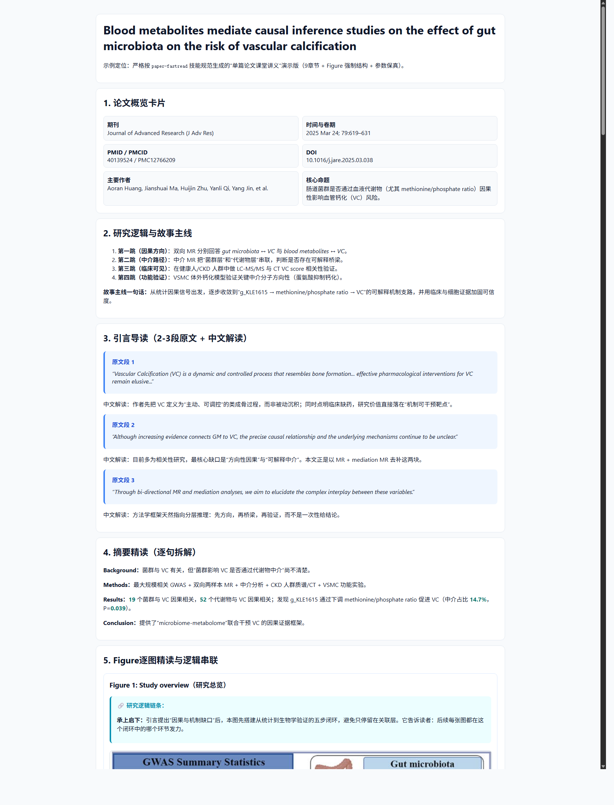
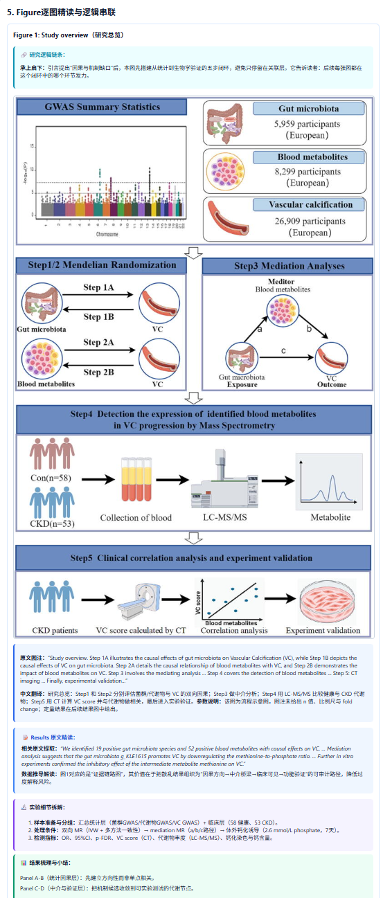

# paper-fastread

`paper-fastread` 是一个面向单篇科研论文的讲义生成技能仓库：把论文重构为 **9 章节中文 HTML 讲义**，并支持**一键导出 PDF**。

核心定位：

- 逐图精读（逻辑链条 + Results 原文 + 参数保真）
- 方法学深挖（不是摘要复述）
- 课堂可讲（结构统一、可复用）
- 发布友好（HTML + PDF 双格式）

---

## ✨ 功能亮点

- 固定 9 章节输出结构（教学模板化）
- Figure 强制模块：`logic-box → caption-box → quote-box → steps-box → results-box`
- 默认文献源策略：**OpenAlex 优先**，医学论文追加 PubMed 交叉验证
- 已集成 `paper-distill-mcp` 工作流（检索文献、抓取主图）
- 新增：**HTML → PDF 导出脚本** `tools/html_to_pdf.sh`

---

## 🚀 快速开始

### 1) 安装并连接 paper-distill-mcp（OpenCode）

```bash
uv tool install paper-distill-mcp
opencode mcp list
```

确保看到：`paper-distill connected`。

### 2) 配置文献来源（建议）

```bash
OPENALEX_EMAIL=your-email@example.com
NCBI_EMAIL=your-email@example.com
NCBI_API_KEY=your-ncbi-api-key
```

> 详见：`references/literature-source-setup.md`

### 3) 生成讲义 HTML

按 `SKILL.md` 的 session start 固定提示先做来源检查，再生成讲义。

### 4) 导出 PDF（新增）

```bash
bash tools/html_to_pdf.sh examples/Blood_metabolites_VC_PMID40139524_lecture_demo.html
```

可指定输出路径：

```bash
bash tools/html_to_pdf.sh examples/Blood_metabolites_VC_PMID40139524_lecture_demo.html outputs/demo.pdf
```

---

## 🖼️ 展示截图

示例来源：`examples/Blood_metabolites_VC_PMID40139524_lecture_demo.html`

### 讲义总览



### Figure 精读模块（logic/caption/quote/steps/results）



---

## 📁 仓库结构

```text
paper-fastread/
├── SKILL.md
├── README.md
├── references/
├── templates/
├── tools/
├── examples/
└── assets/screenshots/
```

---

## 📚 关键文档

- 技能入口：`SKILL.md`
- 文献源配置：`references/literature-source-setup.md`
- MCP 搜索取图流程：`references/paper-distill-mcp-workflow.md`
- 单篇讲义规范：`references/single-paper-lecture-template-zh.md`
- HTML 转 PDF：`references/html-to-pdf.md`
- 发布清单：`GITHUB_RELEASE_CHECKLIST.md`
